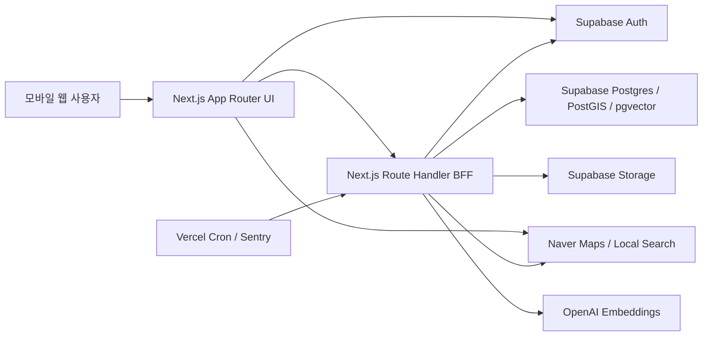

# PinPaw 현재 프로젝트 진행 현황

> 기준일: 2026-08-02 (KST)  
> 기준 브랜치: `main`  
> 기준 커밋: `3a8887b`  
> 판정: **기능 통합은 크게 진전됐지만 공개 운영 출시는 아직 HOLD**

## 1. 이 문서의 역할

이 문서는 현재 체크아웃된 코드의 구현 범위, 실행 환경, 검증 결과와 남은 출시
조건을 한곳에서 확인하기 위한 최신 스냅샷이다.

- 과거 위험의 상세 원인은 [보안·품질 감사](./SECURITY_AND_QUALITY_AUDIT.md)를
  참고한다.
- 장기 과제 ID와 출시 순서는 [공개 MVP 로드맵](./PUBLIC_MVP_ROADMAP.md)을
  참고한다.
- 실제 운영 절차는 [운영 Runbook](./runbooks/OPERATIONS.md)을 참고한다.
- 승인된 UX 방향은
  [따뜻한 현장 구조 도구 UX 설계](./superpowers/specs/2026-08-02-pinpaw-warm-field-ux-design.md)를
  참고한다.
- 2026-07-25 문서의 수치와 상태는 당시 감사 기록이며, 현재 상태는 이 문서를
  우선한다.

## 2. 요약

이전의 빈 `main`과 달리 현재 브랜치에는 목격 제보, 유실글, 지도, 추천,
인증, 알림, 신고·차단, 계정 삭제, 백그라운드 작업과 운영 통제가 통합돼 있다.
코드 기준 공개 MVP 기능은 상당 부분 구현됐으나 다음 이유로 운영 출시를 승인할
수는 없다.

1. 전체 테스트 246개와 TypeScript, production build는 통과했다.
2. ESLint는 React 규칙 오류 2건과 미사용 변수 경고 1건으로 실패한다.
3. Prettier 검사는 91개 파일에서 실패한다. 로컬 `sim_test/.venv`가 검사 범위에
   들어간 문제도 포함한다.
4. Docker와 `psql`이 없어 빈 Supabase DB migration replay, 실제 권한 행렬,
   동시성 검증을 이 노트북에서 실행하지 못했다.
5. 연결 가능한 브라우저가 없어 지도·로그인·제보·추천의 실제 모바일 E2E와
   시각 회귀를 확인하지 못했다.
6. npm 보안 감사는 네트워크 제한으로 실행되지 않았다. 외부 npm registry에
   의존성 메타데이터를 보내는 작업은 사용자 명시 승인을 받은 뒤 재실행해야 한다.

## 3. 저장소 규모

| 지표                      |     현재 값 |
| ------------------------- | ----------: |
| Git 커밋                  |        59개 |
| 추적 파일                 |       316개 |
| `src` TypeScript/TSX      |       154개 |
| `src` TypeScript/TSX 라인 | 약 19,457줄 |
| App Router 페이지         |        12개 |
| API Route                 |        37개 |
| Supabase migration        |        42개 |
| 테스트 파일               |        66개 |
| Node test                 |       246개 |

2026-07-26 이후 인증, 지도, 유실글, 제보 수정, 알림, 모더레이션, 운영 통제,
브랜드 자산이 한 번에 통합됐다. 2026-08-02에는 Vercel 함수 리전을 서울로
고정하고 보호소 데이터 import 운영 확인용 cron이 조정됐다.

## 4. 현재 아키텍처

주요 신뢰 경계:

- 브라우저 공개 키와 서버 전용 service-role key를 분리한다.
- 인증 API는 사용자 JWT를 서버에서 재검증한다.
- 공개 지도는 좌표를 마스킹하고, 회원 정밀 위치는 별도 권한 RPC를 사용한다.
- 업로드는 intent 발급, 실제 바이트 검사, 원자 소비, orphan cleanup 흐름을 갖는다.
- 내부 worker와 cron은 `CRON_SECRET` fail-closed 경계를 사용한다.
- 구조화 로그, request ID, Sentry sanitizer, health/readiness 경계가 구현돼 있다.

## 5. 기능 현황

| 영역          | 구현 상태 | 현재 확인 내용                                         | 남은 운영 증거                             |
| ------------- | --------- | ------------------------------------------------------ | ------------------------------------------ |
| 인증          | 부분 완료 | Kakao OAuth, SSR session, callback, AuthGuard          | 실제 Kakao 로그인·갱신·로그아웃 E2E        |
| 목격 제보     | 부분 완료 | 사진, 위치, 시간, 특징, upload intent, 생성 API        | 실제 Storage·DB 성공/장애·중복 E2E         |
| 제보 관리     | 부분 완료 | 내 제보 목록, 수정, 삭제, cleanup queue                | 소유자/타 사용자 권한·orphan 0 검증        |
| 유실글        | 부분 완료 | 등록, 목록, 상세, 수정, 삭제, 상태 이력                | 실제 상태 전이·공유·삭제 E2E               |
| 지도          | 부분 완료 | 공개 cluster, 회원 pin, 레이어, 경로, 상세 sheet       | Naver SDK 모바일 회귀·메모리·실부하        |
| 추천          | 부분 완료 | 임베딩 worker, 추천 RPC/API, 조건 필터, feedback       | 실제 후보 품질·설명 가능성·지연 측정       |
| 알림          | 부분 완료 | 인앱 알림, 수신 설정, dedupe                           | staging 전달률·opt-out 반영 E2E            |
| 신고·차단     | 부분 완료 | 신고, 양방향 차단, 관리자 triage/audit                 | 사용자·관리자 역할 E2E와 SLA alert         |
| 계정 삭제     | 부분 완료 | ban, lease worker, Storage→DB→Auth 삭제                | 실제 provider 삭제·backup 만료 rehearsal   |
| 보호소 데이터 | 부분 완료 | 공공데이터 import worker와 cron                        | 실데이터 품질·중복·비용·실패 알림          |
| 관측성        | 부분 완료 | Sentry, structured log, health/readiness, SLO snapshot | 운영 dashboard·synthetic alert 수신        |
| CI/CD         | 부분 완료 | GitHub release gate, DB replay job, Vercel 설정        | 실제 required check·branch protection 확인 |

`부분 완료`는 코드가 없다는 뜻이 아니라 실제 외부 서비스와 역할별 E2E 증거가
남았다는 뜻이다.

## 6. 2026-08-02 로컬 검증 결과

| 명령/검사              | 결과                               | 판정    |
| ---------------------- | ---------------------------------- | ------- |
| `npm test`             | 246/246 통과                       | PASS    |
| `npm run typecheck`    | 오류 0                             | PASS    |
| `npm run build`        | Next 16.2.11, 40개 route/page 생성 | PASS    |
| `npm run lint`         | 오류 2, 경고 1                     | FAIL    |
| `npm run format:check` | 91개 파일 경고                     | FAIL    |
| 홈 HTTP smoke          | `200`                              | PASS    |
| 지도 HTTP smoke        | `200`                              | PASS    |
| health HTTP smoke      | `200`                              | PASS    |
| 브라우저 E2E           | 연결 가능한 브라우저 없음          | NOT RUN |
| DB replay/권한/동시성  | Docker·`psql` 없음                 | NOT RUN |
| production `npm audit` | 외부 registry 승인 필요            | NOT RUN |

### 현재 lint 차단 항목

- `src/features/auth/components/AuthFeedbackBanner.tsx`: effect 안의 동기
  `setState`로 `react-hooks/set-state-in-effect` 오류
- `src/features/map/components/NaverMap.tsx`: render 중 ref 갱신으로
  `react-hooks/refs` 오류
- `src/app/(tabs)/recommend/page.tsx`: 사용하지 않는 `session` 경고

### formatting 범위 문제

소스와 문서의 실제 formatting 차이 외에 `sim_test/.venv` 내부의 제3자 파일도
Prettier 대상에 포함됐다. `.prettierignore`에 `**/.venv/**`를 추가한 뒤 앱 코드와
문서의 실제 formatting 차이를 별도로 정리해야 한다.

## 7. 새 노트북 의존성 검토

### 7.1 현재 웹 앱 실행에 이미 준비된 항목

| 항목           | 현재 상태              | 요구사항                         |
| -------------- | ---------------------- | -------------------------------- |
| Node.js        | `22.23.1`              | `>=22 <23`, `.nvmrc=22` 충족     |
| npm            | `10.9.8`               | lockfile v3 사용 가능            |
| `node_modules` | 존재, 약 825MB         | 앱 실행·test·build 가능          |
| Supabase CLI   | npm devDependency 존재 | 로컬 DB 실행 시 사용             |
| `.env.local`   | 핵심 앱 변수 존재      | 실제 값은 문서에서 노출하지 않음 |

**현재 웹 앱을 실행하기 위해 새로 설치할 패키지는 없다.** `npm run dev`, test,
typecheck, build가 기존 설치로 실행됐다. 다만 `npm ls --depth=0`에는 WASM 관련
extraneous 패키지가 6개 표시되므로, 승인 후 `npm ci`로 깨끗한 설치를 재현하면
이 상태를 정리할 수 있다.

### 7.2 전체 로컬 검증에 추가로 필요한 도구

| 용도                  | 누락 항목                                          | 설치 필요성                                    |
| --------------------- | -------------------------------------------------- | ---------------------------------------------- |
| 로컬 Supabase stack   | Docker Desktop 또는 호환 Docker runtime            | DB migration/E2E를 로컬에서 실행하려면 필수    |
| DB 권한 SQL 직접 실행 | PostgreSQL client의 `psql`                         | 권한 행렬 workflow를 로컬에서 실행하려면 필수  |
| 유사도 실험           | Python 3.11/3.12 권장, `sim_test/requirements.txt` | 웹 앱에는 불필요, 실험할 때만 설치             |
| 패키지 보안 감사      | 외부 npm registry 조회 승인                        | 설치가 아니라 의존성 메타데이터 전송 승인 필요 |

현재 macOS에는 Homebrew, Docker, `psql`이 없고 시스템 Python은 3.9.6이다.
핵심 웹 개발만 할 경우 지금 설치할 필요는 없다. DB·유사도 실험 Goal을 시작할
때 범위를 나눠 승인받는 편이 안전하다.

## 8. UI/UX 정적 감사 요약

현재 UI는 동작 흐름을 빠르게 늘리는 과정에서 만들어진 모바일 프로토타입의
성격이 강하다.

- `max-w-md` 중심의 모바일 우선 구조는 현장 제보 서비스와 잘 맞는다.
- 반면 emoji 탭 아이콘, Arial 기본 글꼴, 동일한 둥근 카드와 그림자 반복,
  초록/파랑 상태색 혼용 때문에 브랜드 고유성이 약하다.
- TSX에서 `rounded-*` 사용은 135회, `shadow-*`는 44회다. 모든 정보를 카드로
  감싸는 패턴이 화면 위계를 흐리고 전형적인 생성형 UI 인상을 만든다.
- 목격 제보 첫 화면은 행동이 빠르지만, 큰 정사각형 사진 영역이 화면 대부분을
  차지하고 원시 위·경도 숫자를 사용자에게 노출한다.
- 추천 화면은 반경·기간·개수와 소수점 유사도를 직접 보여준다. 모델 조절 화면처럼
  보이며, 일반 사용자가 원하는 “무엇을 먼저 확인해야 하는가”보다 계산 방식이
  앞에 나온다.
- 지도는 기능이 풍부하지만 `NaverMap.tsx`가 1,627줄이고 여러 floating control,
  sheet, modal, layer selector를 동시에 관리해 인지 부하와 회귀 위험이 크다.
- 내 정보 화면은 사용자 계정보다 유실 사건의 현재 상태가 중요한 플랫폼 특성을
  충분히 반영하지 못하고 일반적인 프로필/아코디언 화면에 가깝다.
- 접근성 기반은 좋아졌지만 `Text`가 title도 항상 `
`로 렌더링하고, 전체 TSX의
  실제 heading은 1개뿐이다. 목격 사진 선택 영역도 semantic label/button과
  키보드 동작을 더 보강해야 한다.

세부 UX 방향과 실행 계획은 사용자 승인 후 별도 문서로 확정한다. 원칙은 AI를
시각적 주인공으로 만들지 않고, 긴급한 현장 행동과 신뢰 가능한 증거를 앞세우는
것이다.

## 9. 진행도 추정

제품 요구사항이 완전히 고정되지 않았으므로 범위로 표현한다.

| 관점                 |   추정 | 근거                                                |
| -------------------- | -----: | --------------------------------------------------- |
| 공개 MVP 기능 코드   | 75~85% | 주요 사용자·운영 흐름이 코드에 존재                 |
| 엔지니어링 통제 구현 | 70~80% | CI, migrations, tests, observability 구현           |
| 실제 출시 증거       | 45~60% | lint/format 실패, DB/staging/browser/DR 증거 미완료 |

출시는 평균 점수로 결정하지 않는다. lint/format, DB replay와 역할별 권한,
브라우저 핵심 흐름, 외부 의존성 감사, backup/rollback rehearsal과 공개 전
Critical/High 0을 모두 만족해야 한다.

## 10. 다음 작업 순서

1. UX 방향을 승인하고 디자인 원칙·정보 구조·핵심 화면 계약을 문서로 고정한다.
2. formatting 검사 범위를 바로잡고 lint 오류 2건·경고 1건을 수정한다.
3. 승인 후 `npm ci`로 새 노트북의 clean install을 재현한다.
4. DB 검증 Goal 착수 시 Docker와 `psql` 설치안을 별도 승인받는다.
5. 빈 DB migration replay, 권한 행렬, 동시성 검사를 실행한다.
6. 모바일 브라우저에서 제보→지도→후보 확인→북마크→종료 핵심 흐름을 검증한다.
7. staging OAuth, Storage, Naver, Sentry, cron과 backup/rollback을 실제로 rehearsal한다.
