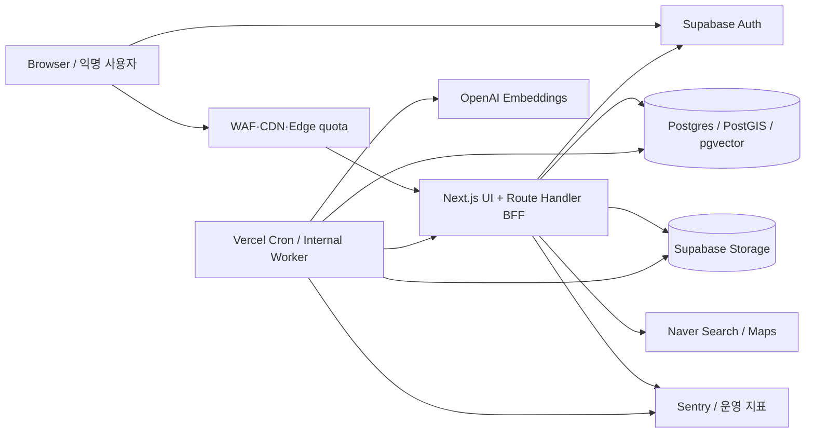

# PinPaw 운영 전 보안 체계 점검

> 기준일: 2026-08-17 (KST)  
> 판정: **공개 운영 전환 HOLD**  
> 범위: 현재 Repository의 Next.js, Supabase Auth/Postgres/PostGIS/Storage, Vercel Cron, Naver API/Maps, OpenAI Embeddings, Sentry  
> 원칙: **Repository·Migration·Runtime 검증 결과가 설계 문서보다 우선한다.**

이 문서는 취약점을 단순 나열하는 보고서가 아니라, PinPaw를 현재의 `Next.js + Vercel + Supabase` 구조 안에서 운영 가능한 보안 통제 체계로 끌어올리기 위한 기준선이다. 사용자가 별도로 개발을 지시하기 전까지는 아래 계획만 작성하며, 코드·DB·배포 설정은 변경하지 않는다.

## 1. Executive Summary

PinPaw는 로그인 없이 약 10초 안에 목격 제보를 받을 수 있어야 하며, 동시에 정확한 위치·사진·보호자 정보의 오남용을 제한해야 한다. 따라서 목표 아키텍처는 익명 UX를 없애는 방식이 아니라 다음의 서버 측 통제를 겹치는 방식이다.

```text
Browser
  → Edge/WAF quota
  → Next.js BFF: 입력 검증·Auth 재검증·Request ID
  → Policy layer: 소유권·개인정보 정밀도·rate limit
  → Allowlisted RPC / worker
  → Postgres·Storage transaction
  → Redacted audit·metric·alert
```

현재 코드에는 중요한 통제가 이미 있다.

- 서버 전용 Supabase Service Role 경계와 access token 재검증
- 공개/회원/소유자별 위치 정밀도 분리
- upload intent, 파일 크기·MIME/signature 검증, 원자적 intent 소비 방향
- DB 기반 rate limit/cooldown/idempotency
- Cron fail-closed, 보안 헤더, 요청 ID, 로그 redaction, 삭제 worker

그러나 코드에 통제가 존재하는 것만으로 운영 통제가 완료된 것은 아니다. 특히 다음 증거가 없으므로 출시 판정을 `HOLD`로 유지한다.

- 빈 Supabase 환경에서 전체 migration replay 후 실제 role/RLS/RPC/Storage matrix 통과
- 실제 staging에서 OAuth, upload, map, recommendation, Cron, 외부 provider 장애 흐름 통과
- production 의존성 audit 0, branch protection/release gate 적용 확인
- DB/Auth/Storage backup restore rehearsal과 RPO/RTO 측정
- 정밀 위치·사진·로그에 대한 실제 redaction 및 삭제 증거

기존 로컬 검증 기록에는 `npm test` 413/413, `npm run typecheck`, `npm run lint`, `git diff --check` 통과가 남아 있다. 이는 코드 회귀의 일부 증거일 뿐, 원격 DB·Storage·브라우저·외부 provider·복구 검증의 대체물이 아니다.

### 현재 개발 진행 결과

이번 보안 hardening 작업에서 다음을 구현했다.

- 검색 secret 환경변수를 `NEXT_PUBLIC_NAVER_SECRET`에서 `NAVER_CLIENT_SECRET`으로 분리하고 readiness·CI·검색 route 안내를 동기화했다.
- public/authenticated map의 304 응답에도 ETag와 각각의 `public`/`private` Cache-Control을 유지하도록 수정했다.
- 추천 block filter RPC 오류 시 원본 추천 목록을 반환하지 않고 `503 SERVICE_UNAVAILABLE`로 fail-closed하도록 수정했다.
- rate-limit 초과 응답에 `Retry-After`를 일관되게 제공하고, rate-limit backend 확인 불가인 `503`에는 해당 헤더를 노출하지 않도록 정리했다.
- upload presign idempotency cache를 인증 사용자 ID 또는 익명 요청의 IP hash에 바인딩해 다른 주체가 동일 키로 signed upload 응답을 재사용하지 못하게 했다.
- 위 세 경계에 대한 security/contract test를 추가하고 기존 fail-open 계약 테스트를 보안 기준에 맞게 갱신했다.

현재 검증 결과는 `npm test` 415/415, typecheck, lint, Webpack build, HTTP boundary integration 8/8 통과다. 다만 Supabase CLI/Docker 미설치로 migration replay, registry DNS 차단으로 npm audit, staging 권한 부재로 OAuth/Storage/provider/Sentry/backup rehearsal은 아직 `VERIFY`다.

## 2. 판단 기준과 증거 수준

| 표기        | 의미                                                    | `CLOSED` 조건                               |
| ----------- | ------------------------------------------------------- | ------------------------------------------- |
| `CONFIRMED` | Repository에서 구현 또는 미구현을 직접 확인             | 근거 파일·함수·migration이 존재             |
| `VERIFY`    | 코드 의도는 있으나 실제 DB·provider·staging 증거가 없음 | 재현 가능한 명령/API 결과와 보관된 evidence |
| `OPEN`      | 코드 또는 운영 절차에 보강이 필요                       | 수정과 회귀 검증 완료                       |
| `HUMAN`     | 법무·정책·사업·권한 승인 없이는 결정할 수 없음          | 담당자와 승인 기록                          |

`CONFIRMED`는 안전하다는 뜻이 아니다. 예를 들어 `security definer`가 존재하는 것은 `CONFIRMED`지만, 실제 role에 EXECUTE가 제한됐는지는 별도 `VERIFY`다.

우선순위는 다음처럼 사용한다.

- **P0**: 출시 전에 반드시 닫아야 하는 인증 우회, 타인 데이터 접근·변조, Service Role/RLS 경계 실패, 중대한 위치 노출, 무제한 Storage 비용 공격
- **P1**: 출시 전에 권장하는 고위험 abuse·운영 통제. 제한된 pilot traffic 전에는 닫는다.
- **P2**: 초기 운영의 안정성·관찰성·Defense-in-depth 개선
- **P3**: 현재 규모에서는 risk acceptance할 수 있으나 규모가 커지면 재평가할 항목

## 3. Actual System Architecture

### 3.1 현재 신뢰 경계



### 3.2 Repository에서 확인한 구현 경계

| 영역          | 확인된 구현                                                  | 운영 전 확인할 것                                    |
| ------------- | ------------------------------------------------------------ | ---------------------------------------------------- |
| Application   | Next.js 16.2.11, App Router, Route Handler, Webpack build    | production build와 실제 route smoke                  |
| Auth          | Supabase SSR client, 서버에서 `getUser(access_token)` 재검증 | OAuth redirect URI, refresh/revoke, deletion-pending |
| Authorization | route·RPC에 owner/admin/privacy 경계가 분산                  | 모든 API/RPC/Storage 직접 우회 negative test         |
| Database      | Postgres/PostGIS/pgvector, migration 다수, 원자 RPC          | remote history와 migration replay 정합성             |
| RLS/RPC       | lock-down migration과 role별 `REVOKE/GRANT` 방향 존재        | 실제 catalog privilege와 role matrix                 |
| Upload        | `upload_intents`, 10 MiB, JPEG/PNG, intent 소비 RPC          | provider URL, orphan cleanup, concurrent replay      |
| Location      | public masked marker, auth/owner precise path                | 반복 query 추론, archived/blocked 데이터             |
| Abuse         | DB rate limit/cooldown/idempotency, request identity         | edge quota, proxy/IP, distributed burst              |
| Operations    | Cron auth, deletion worker, SLO snapshot, Sentry sanitizer   | 실제 alert, 로그 접근, restore rehearsal             |

### 3.3 보호 대상 자산

| 등급     | 자산                                                                                  | 위협                                         |
| -------- | ------------------------------------------------------------------------------------- | -------------------------------------------- |
| Critical | 정확한 GPS, 유실 위치, 이동 trail, 보호자 정보, Auth token, 관리자 권한, Service Role | stalking, 계정·데이터 탈취, 전체 시스템 장악 |
| High     | 사진·EXIF, email, IP hash, 활동 로그, embedding, recommendation cache, API secret     | 개인정보 재식별, 비용 공격, 모델·추천 오염   |
| Medium   | 공개 지역·격자·상태, UI telemetry                                                     | 서비스 신뢰 저하, 대량 수집, 가용성 저하     |

## 4. Documentation Drift

사용자가 제공한 원문은 설계 의도와 점검 요구사항이며, 실제 Notion 원문 자체는 이 작업 환경에 제공되지 않았다. 따라서 Notion의 특정 문장을 현재 구현으로 확정하지 않고, 아래를 현재 확인 가능한 drift로 기록한다.

| 구분                           | 문서/설계에 나타난 기대                                                     | 현재 Repository에서 확인한 사실                                     | 보안 영향                                                          |
| ------------------------------ | --------------------------------------------------------------------------- | ------------------------------------------------------------------- | ------------------------------------------------------------------ |
| 역사적 감사 ↔ 현재 migration   | `users`, `embeddings`, `idempotency_keys` RLS가 없다는 2026-07-25 감사 기록 | `20260725010000_lock_down_data_plane.sql`에 lock-down 구현이 추가됨 | migration이 원격 DB에 실제 반영됐는지 확인 전에는 해결로 보지 않음 |
| 역사적 감사 ↔ 현재 upload 코드 | upload intent와 도메인 row 연결이 없다는 과거 finding                       | `20260725030000_upload_intents.sql`과 관련 RPC가 존재               | 실제 Storage object 검증·경쟁 소비·orphan cleanup은 별도 검증 필요 |
| 28일 보존 설계 ↔ 운영 실행     | `archive_old_records_28d()`와 `archived_at` 설계                            | schema/migration과 worker 경로가 존재                               | 실제 Cron 호출·삭제·복구·backup expiry가 없으면 보존 정책은 미완료 |
| 문서상 보안 통제 ↔ Runtime     | rate limit, ETag, RLS, presigned URL 등이 문서에 기재될 수 있음             | 기능별 코드·migration·runtime evidence가 각각 필요                  | 문서에만 존재하는 통제를 방어책으로 인정하면 false assurance 발생  |

문서와 코드가 충돌하는 경우 이후 finding에는 다음 형식을 사용한다.

```text
[Documentation Drift]
문서 설계: ...
실제 구현: ...
차이: ...
보안 영향: ...
```

## 5. Threat Model

| 행위자         | 가능한 능력                                           | 주요 공격면                                        |
| -------------- | ----------------------------------------------------- | -------------------------------------------------- |
| 익명 공격자    | body/query/header 위조, 병렬 요청, signed upload 반복 | 공개 API, upload intent, Storage 비용, map/search  |
| 일반 회원      | 유효 JWT, 다른 UUID 추측, 자신의 resource 조작        | IDOR/BOLA, precise location, recommendation, claim |
| 악성 관리자    | 관리자 API와 moderation 접근                          | 데이터 은닉·삭제, 권한 오남용, audit 훼손          |
| Secret 탈취자  | Service Role/OpenAI/Naver/Cron secret 사용            | 전체 DB/Storage, 비용, 내부 worker, 개인정보       |
| 공급망 공격자  | dependency·CI action·build 설정 영향                  | build artifact, deploy secret, migration           |
| 내부 운영 실수 | 잘못된 migration·권한·backup 조작                     | RLS 무력화, 복구 실패, 개인정보 잔존               |

### 핵심 공격 흐름

1. 익명 사용자가 `photoKeys`, `userId`, `Idempotency-Key`, `x-forwarded-for`를 조작한다.
2. 회원이 다른 UUID나 `lostPostId`로 인증은 통과하지만 ownership 검사 없이 데이터를 조회한다.
3. 공격자가 browser role로 Supabase REST/RPC/Storage를 직접 호출해 BFF를 우회한다.
4. 공개 map/추천/cache를 반복 호출해 masked location을 정밀하게 추론하거나 provider quota를 소진한다.
5. Cron 또는 Service Role secret이 노출되면 내부 worker와 운영 데이터 plane이 외부 공격면이 된다.

## 6. Findings

### P0 — 출시 전 반드시 해결

#### SEC-DB-01 — 실제 DB migration/RLS 상태 미확정

- **상태**: `VERIFY`
- **위치**: `supabase/schema.sql`, `supabase/migrations/20260725010000_lock_down_data_plane.sql`, `tests/integration/db-permission-matrix.sql`
- **현재 구현**: operational table에 RLS를 켜고 anon/authenticated grant를 회수하는 migration과 정적 permission contract가 있다.
- **문제**: 원격 DB migration history·catalog privilege가 저장소와 다르면 의도한 RLS가 실제 API에 적용되지 않는다.
- **공격 시나리오**: anon/member가 REST table 또는 RPC로 `users`, `embeddings`, `idempotency_keys`, rate-limit, recommendation data를 직접 읽거나 변경한다.
- **영향**: Confidentiality·Integrity·Availability 모두 높음.
- **현재 방어**: migration, 명시적 `REVOKE/GRANT`, permission matrix.
- **개선안**: 격리 DB reset/replay → remote history diff → 실제 anon/member/owner/admin/service-role CRUD와 RPC negative test → evidence 보관.
- **수정 대상**: migration, `supabase/schema.sql`, `tests/integration/db-permission-matrix.sql`, CI workflow, 운영 runbook.
- **검증**: `npm run db:reset`, SQL matrix, 실제 Supabase REST/RPC 호출의 401/403·service-role 정상 결과.

#### SEC-DB-02 — `security definer` RPC 실행 권한과 내부 권한 경계

- **상태**: `VERIFY`
- **위치**: `supabase/migrations/*`, 특히 lock-down migration과 `supabase/schema.sql`의 RPC 정의
- **현재 구현**: 함수별 `search_path = pg_catalog, public, extensions`와 role별 revoke/grant 방향이 존재한다.
- **문제**: 함수 내부 owner/auth 조건과 실제 `EXECUTE` 권한이 하나라도 어긋나면 API 인증을 우회한다.
- **공격 시나리오**: anon/authenticated가 직접 `get_sighting_detail`, map, recommendation, archive 계열 RPC를 호출하거나 허용되지 않은 인자로 다른 row를 조회한다.
- **영향**: 정밀 위치·사진 노출, 데이터 변경, 비용·가용성 공격.
- **개선안**: 함수별 caller matrix를 고정하고 `PUBLIC/anon/authenticated/service_role`를 모두 명시적으로 검사한다. 내부 함수에는 입력 범위·owner·상태·archived·blocked 조건을 함께 둔다.
- **검증**: `has_function_privilege` 결과와 역할별 직접 RPC negative test.

#### SEC-LOC-01 — 정밀 위치 및 trail의 API 수준 노출

- **상태**: `VERIFY`
- **위치**: `supabase/migrations/20260725050000_protect_precise_sighting_locations.sql`, `20260726000000_auth_map_precise_pins.sql`, `src/shared/lib/privacy-location.ts`, map/detail route
- **현재 구현**: public/non-owner는 masked cluster, owner는 precise marker/detail을 받는 방향이다. archived row와 blocked 상태를 확인하는 SQL도 있다.
- **문제**: map 반복 요청, zoom/bbox 조작, recommendation cache, image URL, trail 응답 중 하나가 정밀 값을 반환하면 UI masking은 무의미하다.
- **공격 시나리오**: 비회원이 API를 직접 호출하거나 viewport를 잘게 쪼개 원래 GPS를 추론한다. 회원이 타인의 `lostPostId`로 recommendation/detail을 요청한다.
- **영향**: stalking·재식별·물리적 안전 문제.
- **개선안**: public/auth/owner/admin response schema를 분리하고, non-owner 정밀도 상한·query 반복 제한·최소 count threshold·cache 권한 분리를 정책으로 고정한다.
- **검증**: 각 역할의 raw JSON snapshot, zoom/bbox fuzz, archived/blocked/owner mismatch negative test.

#### SEC-INT-01 — 내부 Cron/Worker가 Service Role과 비용 경계를 가짐

- **상태**: `VERIFY`
- **위치**: `vercel.json`, `src/app/api/v1/internal/*`, `src/shared/lib/cron-auth.ts`, embedding/deletion workers
- **현재 구현**: `CRON_SECRET` 미설정 시 fail-closed helper, lease/RPC, 내부 route가 있다.
- **문제**: secret 탈취·재사용, route별 권한 과다, 동시 실행, provider quota가 분리되지 않으면 내부 endpoint가 고위험 공격면이다.
- **공격 시나리오**: 공격자가 Cron route를 반복 호출해 DB queue를 선점하고 OpenAI 비용·Storage 삭제·import를 발생시킨다.
- **영향**: 전체 데이터 plane, 비용, 가용성.
- **개선안**: route별 worker scope, 짧은 lifetime/rotation, lease, bounded batch, provider quota, 호출 alert를 적용한다.
- **검증**: secret 없음/오류/정상, replay, 20-way concurrent call, provider callback 0/1회 계약 테스트.

### P1 — 출시 전 권장, pilot 전 종료

#### SEC-UP-01 — signed upload와 orphan/object 재사용

- **상태**: `VERIFY`
- **위치**: `src/shared/lib/upload-intents.ts`, upload routes, `supabase/migrations/20260725030000_upload_intents.sql`
- **현재 구현**: bucket별 JPEG/PNG, 10 MiB, intent의 owner/IP/purpose/key/size/expiry, 실제 object 검증과 원자 소비 방향이 있다.
- **추가 보강**: presign idempotency 조회도 인증 owner 또는 익명 IP hash 조건을 함께 사용해 다른 주체의 cached signed URL 재사용을 차단한다.
- **문제**: signed URL의 provider TTL과 DB intent TTL, 실제 Storage public 정책, cleanup 순서가 다르면 orphan·재사용·비용 공격이 발생한다.
- **공격 시나리오**: presign을 대량 발급하고 도메인 row를 만들지 않거나, 다른 사용자 key·만료 intent·MIME 위조 object를 제출한다.
- **영향**: Storage 비용, 사진 도용, 악성 파일·데이터 무결성.
- **개선안**: server-side magic bytes/size 검증, key prefix 고정, `consumed_at` 원자화, provider TTL 이후 cleanup, SVG 차단, public preview와 원본 private 분리 검토.
- **검증**: 정상/위조 MIME/size/signature, 다른 key, 만료·중복·20-way 경쟁 소비, orphan cleanup rehearsal.

#### SEC-RATE-01 — 익명 제보 abuse 및 IP limiter 우회

- **상태**: `VERIFY`
- **위치**: `src/shared/lib/client-ip.ts`, `src/shared/lib/rate-limit.ts`, rate-limit/cooldown migrations, public sighting routes
- **현재 구현**: DB 원자 rate limit/cooldown, request identity, idempotency 계약이 있다.
- **문제**: proxy header 신뢰, NAT/IPv6, 회원 전환, 분산 IP, 병렬 race는 단일 IP limiter를 우회할 수 있다.
- **공격 시나리오**: `x-forwarded-for` 변조 또는 분산 IP로 photo upload·DB insert·presign을 병렬 호출한다.
- **영향**: Bot spam, Storage 비용, DB row 폭증, 공개 데이터 오염.
- **개선안**: 신뢰 proxy 목록 기반 IP 추출, edge quota + DB atomic limiter + account/device risk의 다중 차원, burst·concurrency·idempotency 정책을 분리한다. CAPTCHA/step-up은 사용자 UX 정책 결정 후 도입한다.
- **검증**: spoofed header, NAT, IPv6, 회원 전환, 분산 IP, 50-way concurrency, 동일 payload dedupe.

#### SEC-API-01 — 공개 API와 외부 provider quota 경계

- **상태**: `VERIFY`
- **위치**: `src/app/api/v1/search/local/route.ts`, `src/app/api/v1/public/map/clusters/route.ts`, recommendation routes, Naver/OpenAI clients
- **현재 구현**: search query는 80자·control character를 제한하고 Naver `display=5`·5초 timeout을 사용한다. map viewport는 zoom 1~21·위도/경도 span 2도 이내로 제한하며 public DB rate limit을 적용한다. recommendation은 radius 0.1~100km, days 1~365, topK 1~50과 인증·owner check·cache를 적용한다. provider 호출 비용 metric도 기록한다.
- **문제**: ETag/cache는 호출 전 비용과 DB 부하를 막지 못한다. bbox, zoom, topK, radius, days, response byte limit이 route별로 고정되지 않으면 quota exhaustion이 가능하다.
- **공격 시나리오**: query·viewport·recommendation parameter를 최대 범위로 반복해 Naver/OpenAI와 DB 비용을 발생시킨다.
- **영향**: Availability·비용·운영 quota.
- **개선안**: route별 quota, 최대 viewport·body·response, upstream timeout, bounded retry, circuit breaker, provider cost metric/alert.
- **검증**: 관련 unit/contract test와 HTTP boundary test는 통과했다. 남은 staging 검증은 parameter fuzz, 실제 quota boundary, upstream timeout/5xx, provider quota alert와 429/503 전달이다.

#### SEC-CACHE-01 — 추천 block filter 장애 시 fail-open

- **상태**: `VERIFY`
- **위치**: `src/app/api/v1/recommendations/route.ts`, `tests/unit/recommendation-evidence-enrich.test.mjs`
- **이전 구현**: `filter_blocked_sighting_ids` RPC 오류가 나면 원본 추천 목록을 그대로 반환했다.
- **위험**: 차단 관계를 적용하지 못하는 순간 사용자가 보지 않아야 할 추천 결과가 노출될 수 있다.
- **현재 보강**: block filter 오류를 운영 오류로 기록하고 추천 응답을 `503 SERVICE_UNAVAILABLE`로 닫는다. 정상 응답은 필터 RPC가 반환한 visible ID에 한정한다.
- **남은 검증**: 실제 staging에서 RPC 장애·권한 오류·빈 결과·cache hit/fresh 계산 양쪽이 모두 fail-closed인지 확인한다.

#### SEC-RATE-02 — rate-limit 응답의 재시도 계약 불일치

- **상태**: `VERIFY`
- **위치**: `src/shared/lib/api-response.ts`, rate-limited API routes
- **이전 구현**: 일부 route만 `Retry-After`를 반환해 client와 proxy가 재시도 시점을 일관되게 알 수 없었다.
- **현재 보강**: 공통 `retryAfterHeaders` helper를 사용해 429에만 양의 정수 초 단위 헤더를 반환하고, rate-limit 저장소 장애로 인한 503에는 오해를 유발하는 재시도 헤더를 붙이지 않는다.
- **남은 검증**: staging에서 실제 초과 응답의 헤더·값·proxy 전달 여부와, rate-limit RPC 장애 시 503 fail-closed를 확인한다.

#### SEC-AUTH-01 — OAuth callback, session lifecycle, deletion-pending

- **상태**: `VERIFY`
- **위치**: `src/app/auth/callback/route.ts`, `src/shared/supabase/server.ts`, auth config
- **현재 구현**: 검증된 `APP_ORIGIN`과 상대 redirect 정규화, 서버 Auth 재검증 방향이 있다.
- **추가 보강**: readiness가 `APP_ORIGIN`의 존재뿐 아니라 정확한 HTTPS canonical origin인지 검증하도록 수정했다. 잘못된 production origin은 dependency probe 전에 fail-closed한다.
- **문제**: 실제 provider redirect URI, refresh/revoke/logout, 계정 삭제 중 세션 차단을 staging에서 확인하지 않았다. production callback의 외부 redirect error 흐름은 현재 배포에서 HTTP 503으로 관찰되어 canonical origin 설정과 재배포 확인이 필요하다.
- **개선안**: canonical origin만 허용하고 관리자 MFA·짧은 session·재인증을 적용한다. provider별 정상/변조 callback을 E2E로 고정한다.
- **검증**: external/scheme-relative/backslash redirect, expired/refresh/revoke/logout/deletion-pending.

#### SEC-ADMIN-01 — 관리자 권한 lifecycle과 moderation audit

- **상태**: `VERIFY`
- **위치**: `src/shared/lib/admin-authorization.ts`, admin routes, `20260725080000_admin_moderation_audit.sql`, reports/blocks migrations
- **문제**: claim 기반 admin 권한 자체보다 계정 생성·MFA·JIT·회수·break-glass·정기 review가 운영 절차에 의존한다.
- **개선안**: 관리자 role을 일반 profile metadata와 분리하고 actor, target, reason, request ID, before/after hash를 append-only audit에 남긴다.
- **검증**: MFA 없는 admin 거부, 권한 회수 즉시 반영, moderation state transition/audit immutability.

#### SEC-SUPPLY-01 — Dependency/CI/build provenance

- **상태**: `VERIFY`
- **위치**: `package.json`, `package-lock.json`, `.github/workflows/release-gate.yml`
- **현재 구현**: Node 22 engine, npm lock, `npm ci`, 테스트·typecheck·lint·Webpack build·HTTP integration·production audit를 release gate에서 실행한다. `nanoid` 고위험 advisory(`<3.3.18`)를 `3.3.18` override로 수정했고 실제 `npm audit --omit=dev --audit-level=low` 결과는 0 vulnerabilities다. CycloneDX SBOM을 생성해 14일 보존 artifact로 업로드한다. migration replay와 DB permission/concurrency job도 별도 gate로 실행한다.
- **개선안**: clean checkout에서 `npm ci`, production audit, build, test, SBOM, lockfile review, branch protection, trusted/pinned action을 release gate에 묶는다.
- **검증**: workflow contract test와 로컬 test/typecheck/lint 통과. 남은 검증은 GitHub에서 clean checkout의 실제 audit 결과, SBOM artifact, branch protection required check, 의도적 실패 차단을 확인하는 것이다.

### P2 — 초기 운영 안정성

#### SEC-SECRET-01 — Secret naming과 client bundle 경계

- **상태**: `VERIFY`
- **위치**: `.env.example`, `src/shared/lib/naver-credentials.ts`, `src/shared/lib/operational-health.ts`, `.github/workflows/release-gate.yml`
- **현재 구현**: 검색 secret을 `NAVER_CLIENT_SECRET`으로 통일하고 `NEXT_PUBLIC_NAVER_SECRET` 사용을 제거했다. 지도 browser key만 public prefix를 사용한다.
- **문제**: 실제 배포 환경의 이전 변수 폐기·rotation과 build artifact/source map 검증은 아직 운영 evidence가 없다.
- **개선안**: 기존 secret을 rotate하고 build artifact secret scan, readiness staging check, provider 호출 smoke를 실행한다.
- **검증**: `tests/security/naver-secret-boundary.test.mjs`, tracked files·source map·bundle의 secret pattern 0, 이전 값 폐기 확인.

#### SEC-OBS-01 — 로그·Sentry의 실제 PII redaction

- **상태**: `OPEN`
- **위치**: `src/shared/lib/structured-log.ts`, Sentry config, `src/instrumentation*.ts`, `docs/runbooks/OPERATIONS.md`
- **개선안**: synthetic GPS/note/JWT/cookie/Authorization/presigned URL을 staging 이벤트에 넣고 실제 Sentry/Vercel ingest에서 원문 0을 확인한다. 접근 role·보존·export 제한을 정한다.

#### SEC-DR-01 — DB/Auth/Storage lifecycle과 복구

- **상태**: `VERIFY`
- **위치**: `20250218120000_add_archived_at_28d_archiving.sql`, `src/shared/lib/account-deletion-worker.ts`, `20260725100000_account_deletion_jobs.sql`, operations runbook
- **문제**: archive 함수·삭제 worker가 존재해도 실제 Cron, backup retention, restore 후 삭제 데이터 잔존 여부를 증명하지 않으면 개인정보 lifecycle이 완성되지 않는다.
- **개선안**: 생성→사용→archive→삭제→backup expiry를 데이터 종류별로 정의하고 격리 프로젝트에서 restore/replay/checksum/권한/E2E를 수행한다.
- **자동화된 현재 검증**: account deletion worker 순서·재시도·tombstone 최소화와 운영 runbook의 RPO/RTO·격리 복구·permission matrix·checksum 증거 양식을 contract test로 고정했다.
- **남은 검증**: RPO ≤ 24시간, RTO ≤ 4시간, provider backup expiry, 실제 backup restore, 복구 후 DB/Storage/Auth/embedding/cache/token 처리 결과.

### P3 — 장기 개선 또는 정책 승인 후

- 공개 map의 differential privacy·최소 count threshold 고도화
- 전문 이미지 malware scanning/thumbnail quarantine 도입 여부
- 독립 침투 테스트·분기별 외부 보안 리뷰
- 별도 SIEM, microservice, enterprise IAM은 현재 규모에서 기본안으로 채택하지 않음

## 7. Authentication / Authorization

모든 보호 API는 다음 순서를 지킨다.

```text
1. Authentication: token/session을 Auth 서버에서 재검증
2. Resource lookup: 요청 ID로 row를 조회
3. Authorization: owner/admin/member/privacy/status/block 조건 확인
4. Data minimization: 요청 주체에 필요한 필드만 projection
5. Response/log: raw token·위치·note를 제외하고 반환·기록
```

금지 패턴:

- client가 전달한 `userId`를 인증 근거로 사용
- UUID를 안다고 해서 타인 resource를 조회·수정
- Auth 확인 후 ownership 확인 전에 cache hit 반환
- Service Role을 사용하면서 application authorization을 생략
- UI에서만 필드를 숨기고 API/DB response에는 포함

권한 검증 표는 개발 단계에서 다음 형태로 유지한다.

| 대상                             |           anon |  authenticated |       owner |            admin |      service worker |
| -------------------------------- | -------------: | -------------: | ----------: | ---------------: | ------------------: |
| public masked map                |           허용 |           허용 |        허용 |             허용 |             필요 시 |
| precise location                 |           거부 |      정책 범위 |        허용 | 승인된 운영 범위 |           작업 범위 |
| own lost post                    |           거부 |      자기 것만 |        허용 |  moderation 범위 | direct 금지/필요 시 |
| embedding/rate-limit/idempotency |           거부 |           거부 |        거부 |             거부 |           allowlist |
| upload intent                    | API를 통해서만 | API를 통해서만 | 자기 intent |        운영 범위 |             cleanup |

## 8. RLS / RPC 전수 검토 기준

각 table과 function은 아래 포맷으로 evidence를 남긴다.

```text
Table/Function:
RLS Enabled / Security Definer:
SELECT / INSERT / UPDATE / DELETE / EXECUTE:
Owner 연결:
service_role 사용 위치:
위험:
개선 필요:
검증 evidence:
```

검토 대상에는 `profiles/users`, `lost_posts`, `sightings`, `uploads/upload_intents`, `pins`, `trails`, `embeddings`, `recommendation_cache`, `idempotency_keys`, `rate_limit_*`, reports/blocks, notification, audit, storage.objects를 포함한다.

반드시 확인할 것:

- RLS disabled, `USING (true)`, 과도한 SELECT
- browser role의 직접 CRUD 및 Storage metadata 접근
- Auth user와 row owner 연결 오류
- `security definer`의 고정 search path·입력 검증·role execute
- service_role이 우회한 곳의 별도 application authorization

## 9. Anonymous Sighting Abuse

익명 제보를 유지하되 한 통제에 의존하지 않는다.

| 통제                    | 목적                           | 출시 증거                                |
| ----------------------- | ------------------------------ | ---------------------------------------- |
| schema/body validation  | malformed·mass assignment 차단 | 경계값/unknown field 테스트              |
| IP identity             | 저비용 자동화 억제             | trusted proxy·IPv4/IPv6 테스트           |
| DB atomic rate/cooldown | 동시 요청 race 차단            | 20~50-way 결과가 정책 count와 일치       |
| upload intent           | Storage와 도메인 row 연결      | 만료·재사용·다른 key 거부                |
| idempotency             | timeout 재시도와 중복 row 차단 | 동일 key 동일 응답, payload mismatch 409 |
| edge quota              | 분산 abuse 비용 제한           | route별 429 및 provider 비용 alert       |
| moderation              | spam·유해 콘텐츠 대응          | 신고 SLA·hide·appeal runbook             |

CAPTCHA, 전화번호 인증, device fingerprint 같은 UX 변경은 기술자가 임의로 도입하지 않고 `HUMAN`으로 분리한다.

## 10. Storage / Upload Security

현재 migration은 `sightings`·`lost` bucket을 JPEG/PNG, 10 MiB로 제한하고 browser role의 metadata/mutation을 제한하는 방향이다. 운영 기준은 다음과 같다.

- object key는 서버가 생성한 purpose/date/UUID pattern만 허용
- presign은 인증 주체 또는 익명 IP hash와 intent에 바인딩
- MIME header, 확장자, 실제 magic bytes, 실제 size를 서버에서 모두 검증
- intent 만료와 provider signed URL 만료 순서를 분리해 orphan을 조기에 삭제하지 않음
- 도메인 row 생성과 intent 소비를 같은 transaction에서 원자화
- SVG·HTML·스크립트 파일은 허용하지 않음
- 원본 private/quarantine, 공개 preview는 최소 필드·최소 수명으로 분리하는 정책을 결정
- 삭제 worker는 Storage 삭제 성공 후에만 DB cleanup을 수행

## 11. Map / Location Privacy

역할별 response 계약은 다음과 같이 고정한다.

| 주체                    | 허용 데이터                                           | 금지 데이터                                           |
| ----------------------- | ----------------------------------------------------- | ----------------------------------------------------- |
| Public                  | 지역/격자/상태/최소 count                             | precise lat/lng, raw note, owner identity, full trail |
| Authenticated non-owner | public와 동일한 최대 정밀도 또는 정책상 제한된 detail | 타인 precise GPS, 불필요한 개인 정보                  |
| LostPost owner          | 자기 유실글·권한이 승인된 제보의 최소 precise 데이터  | unrelated user data, archived/blocked data            |
| Admin                   | moderation 목적의 최소 필요 데이터                    | 목적 없는 bulk export                                 |

검증은 UI가 아닌 raw API response를 대상으로 한다. viewport 분할, zoom 최대치, cluster 반복, recommendation cache, image URL/EXIF, archived/blocked/closed 상태를 함께 검사한다.

## 12. Cache Security

cache lookup은 항상 다음 순서다.

```text
Auth → Ownership / policy → Status / block / expiry → Cache lookup → Minimized response
```

검토 항목:

- 사용자별 응답 key에 user/role/policy version이 반영되는가
- Authorization 이전에 private cache가 반환되지 않는가
- CDN이 private response를 저장하지 않는가
- 권한 회수·차단·archive 후 stale cache가 정밀 데이터를 반환하지 않는가
- ETag/304가 원래 body의 권한을 우회하지 않는가

## 13. Secret Management

검색 대상은 `SUPABASE_SERVICE_ROLE_KEY`, `DATABASE_URL`, `OPENAI_API_KEY`, Naver secret, `JWT SECRET`, private key, `CRON_SECRET`, Sentry auth token이다. 결과에는 실제 값을 출력하지 않는다.

필수 경계:

- 브라우저에는 public anon key와 지도 browser key만 전달
- Service Role/OpenAI/Naver search/Cron/Sentry secret은 server/worker secret store에만 보관
- `NEXT_PUBLIC_*`는 공개해도 되는 값에만 사용
- `.env*`, test fixture, source map, build artifact, log에서 secret scan
- Git history secret scan은 별도 수행하며 현재 환경에서 확인하지 못하면 `확인 불가 - 별도 Git History Secret Scan 필요`로 기록
- secret 교체 후 이전 값 revoke, 접근 role과 마지막 사용 시각 기록

## 14. Web Application Security

정적 코드와 staging 공격 테스트를 분리한다.

| 항목              | 확인 기준                                                                |
| ----------------- | ------------------------------------------------------------------------ |
| XSS/Stored XSS    | note·pet name·report reason의 render/escape, HTML/SVG 업로드 차단        |
| SQL/RPC injection | parameterized query, RPC argument validation, dynamic SQL 없음           |
| CSRF/CORS         | cookie mutation의 same-site/CSRF 경계, 허용 origin 최소화                |
| Open redirect     | canonical `APP_ORIGIN`, same-origin relative path만 허용                 |
| SSRF              | 외부 URL fetch allowlist, user-controlled URL fetch 없음                 |
| Path traversal    | object key server generation, `..`·slash injection 거부                  |
| Mass assignment   | 허용 필드 schema와 server-owned field 분리                               |
| Headers           | CSP, HSTS, X-Frame-Options, nosniff, Referrer-Policy, Permissions-Policy |
| Cookie            | Secure, HttpOnly, SameSite, scope, logout/revoke                         |

`tests/security/*`의 정적 계약은 브라우저/실제 provider 통합 검증이 완료됐다는 의미가 아니다.

## 15. Data Lifecycle / Privacy

각 데이터는 아래 lifecycle table을 가져야 한다.

| 데이터                 | 생성              | 사용                      | Archive              | 삭제/backup expiry           | owner               |
| ---------------------- | ----------------- | ------------------------- | -------------------- | ---------------------------- | ------------------- |
| LostPost/Sighting      | BFF/RPC           | map/detail/recommendation | `archived_at`/status | account deletion + retention | product/privacy     |
| Photo/Object           | upload intent     | preview/detail            | domain 상태와 연동   | Storage worker               | engineering         |
| Trail/precise location | sighting/update   | owner flow                | status/retention     | deletion job                 | product/privacy     |
| Embedding/cache        | worker            | recommendation            | TTL/status           | queue/cache cleanup          | engineering         |
| Log/audit              | request/operation | incident/audit            | retention            | provider expiry              | operations/security |

확정이 필요한 정책:

- 28일 archive가 archive만 의미하는지 실제 삭제까지 의미하는지
- precise location·photo·note별 보존기간
- account deletion과 backup expiry의 관계
- 신고·audit의 법적 보존 예외

이 네 가지는 `HUMAN` 승인 없이는 코드로 결정하지 않는다.

## 16. Logging / Monitoring

필수 관찰 지표:

- 5xx, 401/403, 429 추이
- upload intent 발급·검증·소비 실패, orphan object 수
- DB queue age, worker lease, duplicate execution
- provider latency/error/quota/cost
- precise location 요청, moderation action, account deletion 상태

로그와 Sentry에 포함하면 안 되는 값:

`JWT`, cookie, Authorization header, Service Role/OpenAI/Naver/Cron secret, raw GPS, free-form note, presigned URL query, 원문 개인정보.

staging synthetic payload로 redaction을 검증하고 실제 운영 계정으로 alert 수신·escalation을 확인한다.

## 17. Dependency / Supply Chain

현재 package manager는 npm이며 Node 범위는 `>=22.0.0 <23`이다. release gate는 다음을 수행해야 한다.

```bash
npm ci
npm audit --omit=dev --audit-level=low
npm test
npm run typecheck
npm run lint
npm run build
```

추가 기준:

- lockfile diff는 review 대상
- production dependency의 Critical/High는 0
- CI action은 신뢰된 버전 또는 SHA로 고정
- SBOM과 build artifact provenance 저장
- audit 결과만으로 안전 판정하지 않고 실제 PinPaw 코드에서 advisory 경로 사용 여부 확인

## 18. Agent가 직접 수행·수정 가능한 작업

| 작업                                          | 주체       | 필요 권한                   | 결과물                     |
| --------------------------------------------- | ---------- | --------------------------- | -------------------------- |
| Repository·migration·route inventory          | Agent      | local read                  | 파일/함수/route inventory  |
| 정적 secret pattern scan                      | Agent      | local read                  | 값 없는 scan report        |
| schema validation·input contract 테스트       | Agent      | local                       | unit/API test              |
| RLS/RPC migration 및 permission contract 초안 | Agent      | code review 권한            | migration/test diff        |
| upload intent·idempotency·rate-limit 코드     | Agent      | code 변경 권한              | code + regression test     |
| security header·origin·redaction contract     | Agent      | code 변경 권한              | test/build evidence        |
| CI release gate·runbook 업데이트              | Agent      | repository 설정 변경 권한   | workflow/doc diff          |
| staging negative test 자동화                  | Agent      | staging credential/API 권한 | evidence artifact          |
| production secret rotation·provider 설정 변경 | Agent 보조 | 운영 권한                   | 실행 로그, rotation record |

Agent는 구현 전 현재 working tree 변경을 보존하고, 각 작업을 작은 단위로 나누며, 변경 후 해당 테스트와 전체 회귀를 실행한다. 실제 production에 irreversible한 변경을 수행할 권한은 별도 승인 없이는 가정하지 않는다.

## 19. Human Decision Required

다음은 보안 코드로 임의 결정하지 않는다.

- 익명 UX를 유지할 rate limit 수치와 CAPTCHA/전화 인증 도입 여부
- public/member/owner/admin별 위치 정밀도와 최소 count 정책
- photo·GPS·note·trail·log의 보존기간과 삭제 예외
- 관리자 MFA, IP allowlist, break-glass, JIT 권한 정책
- abuse 신고 SLA, 자동 hide, appeal/복구 정책
- backup 보존과 개인정보 삭제 요청의 법적 처리
- risk acceptance와 공개 traffic 확대 승인

## 20. Risk Acceptance

Risk acceptance는 “당장 수정하지 않음”이 아니라 다음 정보를 가진 기록이어야 한다.

```text
Finding ID:
남은 위험:
영향 자산:
현재 완화책:
수용 사유:
수용 기간/만료일:
담당자:
재평가 조건:
승인자:
```

현재는 P0가 모두 실제 evidence 없이 `VERIFY`인 상태이므로 public traffic 확대를 승인하지 않는다. P2/P3는 pilot 규모·비용·사용자 데이터 민감도에 따라 별도 수용할 수 있지만, precise location·Service Role·RLS 경계 실패는 수용 대상이 아니다.

## 21. 개발 진행 순서

개발은 다음 순서를 지킨다. 각 Phase는 독립적인 검증 결과를 남긴 뒤 다음 Phase로 넘어간다.

### Phase 0 — Discovery와 기준선 고정

1. `package.json`, `src/app/api`, `src/shared`, `supabase/schema.sql`, 전체 migration, `tests/security`, `tests/integration`, `.github/workflows` inventory를 생성한다.
2. API/RPC/Storage bucket/Cron/provider secret/data asset catalog를 표로 고정한다.
3. 각 자산의 owner, 목적, 보존기간, 공개 범위, 삭제 증거를 `HUMAN` 결정 항목과 분리한다.
4. 기존 테스트를 실행하고 실패·미실행 항목을 기록한다.

**완료 기준**: 분석 대상과 제외 범위가 파일 경로와 함께 확정되고, 실행할 수 없는 검증에는 이유가 적혀 있다.

### Phase 1 — DB/RLS/RPC 권한 경계

1. 빈 DB에서 migration reset/replay를 실행한다.
2. 원격 migration history와 저장소 migration을 diff한다.
3. table RLS, role grant, function execute, function search path를 catalog query로 추출한다.
4. anon/authenticated/owner/admin/service-role permission matrix와 직접 REST/RPC negative test를 실행한다.
5. 불일치가 있으면 최소 migration만 추가하고 정적 계약과 DB matrix를 함께 갱신한다.

**완료 기준**: browser role이 operational table·precise data·service RPC를 직접 읽거나 쓰지 못하고, 허용된 owner flow만 통과한다.

### Phase 2 — Auth/Authorization/Location

1. 모든 보호 route에서 Auth 재검증→resource lookup→owner/policy→projection 순서를 확인한다.
2. UUID, `userId`, `lostPostId`, `sightingId`, cache key 변조 negative test를 추가한다.
3. public/auth/owner/admin의 raw JSON response snapshot을 만든다.
4. zoom/bbox 분할·archived/blocked/closed·recommendation cache·trail을 조합해 위치 추론 테스트를 한다.
5. OAuth callback, logout, refresh, revoke, deletion-pending, admin MFA 정책을 staging에서 검증한다.

**완료 기준**: 타인 데이터·정밀 위치·stale cache가 역할 우회로 반환되지 않고, 사람 승인 항목은 코드 변경 없이 명시돼 있다.

### Phase 3 — Anonymous Abuse와 Upload

1. trusted proxy/IP identity와 route별 quota를 정의한다.
2. DB atomic limiter, cooldown, idempotency의 동시성 테스트를 실행한다.
3. upload intent 발급·provider upload·server byte/signature 검증·도메인 row 생성·consumption을 한 흐름으로 검증한다.
4. 만료·다른 owner/IP·다른 purpose·다른 key·MIME spoof·oversize·duplicate·timeout retry를 테스트한다.
5. provider URL TTL 이후 orphan cleanup을 rehearsal한다.

**완료 기준**: 익명 UX를 유지하면서 정책 이상 요청은 429/409/4xx로 닫히고, 유효하지 않은 object·중복 row·무제한 비용 경로가 재현되지 않는다.

### Phase 4 — Secret/Provider/Observability

1. public/private 환경변수 이름과 사용처를 정리한다.
2. build artifact/source map/tracked file/log secret scan을 실행한다.
3. Naver/OpenAI timeout, retry, quota, circuit breaker, cost alert를 확인한다.
4. synthetic PII를 staging에 보내 Sentry/Vercel redaction과 접근 권한을 확인한다.
5. Cron replay·lease·duplicate execution·provider 장애·503/429 계약을 검증한다.

**완료 기준**: secret 원문과 민감정보가 client/log/telemetry에 없고, provider 장애가 bounded failure로 끝난다.

### Phase 5 — Lifecycle/Recovery/Release

1. LostPost, Sighting, photo, trail, embedding, cache, log별 archive/delete/backup 정책을 승인받는다.
2. DB/Auth/Storage backup을 격리 환경에 restore한다.
3. row count/checksum/permission/E2E/삭제 결과를 비교한다.
4. application rollback과 migration rollback 또는 forward-fix 절차를 rehearsal한다.
5. CI required checks, audit 0, build, staging evidence, alert 수신, runbook, 담당자 sign-off를 release packet으로 묶는다.

**완료 기준**: RPO ≤ 24시간, RTO ≤ 4시간, P0/P1 finding과 human decision이 승인 상태이며 public traffic 확대 조건이 충족된다.

## 22. Agent 실행용 체크리스트 포맷

모든 체크 항목은 사람의 선언이 아니라 다음 필드를 가진 실행 단위로 작성한다.

```markdown
- [ ] 항목명
  - 실행 주체: agent | human | joint
  - 필요 권한: local | staging | production
  - 선행 조건:
  - 실행 명령/API:
  - 성공 기준:
  - 증거 파일:
  - 실패 시 조치:
  - 승인 필요: yes | no
```

예시:

```markdown
- [ ] operational table의 browser role 직접 CRUD가 거부되는지 확인
  - 실행 주체: agent
  - 필요 권한: staging
  - 선행 조건: migration replay 완료, 테스트 role/JWT 준비
  - 실행 명령/API: `tests/integration/db-permission-matrix.sql` 및 REST negative test
  - 성공 기준: anon/authenticated의 SELECT/INSERT/UPDATE/DELETE가 모두 거부
  - 증거 파일: `artifacts/security/db-permission-matrix.json`
  - 실패 시 조치: migration/GRANT를 수정하고 Phase 1 재실행
  - 승인 필요: no
```

## 23. Release Security Checklist

### Gate 0 — 기준선

- [ ] 데이터·API·RPC·Storage·Cron·secret inventory가 저장소와 환경에 대해 일치한다.
- [ ] P0/P1/P2/P3와 `CONFIRMED/VERIFY/OPEN/HUMAN` 상태가 모든 finding에 있다.
- [ ] release 승인자·보안 검토자·incident 연락망이 지정됐다.

### Gate 1 — DB와 권한

- [ ] migration reset/replay 및 remote history diff가 저장됐다.
- [ ] anon/authenticated/owner/admin/service-role table/RPC/Storage matrix가 통과했다.
- [ ] IDOR, owner mismatch, archived/blocked/closed negative test가 통과했다.
- [ ] 20~50-way concurrent create/claim/rate-limit/upload 소비가 정책대로 동작한다.

### Gate 2 — 위치·Upload·Abuse

- [ ] public/auth/owner/admin raw response에 위치 정밀도와 필드가 정책과 일치한다.
- [ ] zoom/bbox/cluster 반복으로 precise location을 추론할 수 없다.
- [ ] MIME/signature/size/key/purpose/expiry/owner/IP 검증이 서버에서 수행된다.
- [ ] presign abuse, orphan cleanup, duplicate upload, timeout retry가 통과한다.
- [ ] edge quota + DB limiter + idempotency가 분산·병렬 요청에서 통과한다.

### Gate 3 — Secret·Web·Provider

- [ ] client bundle/source map/tracked file/log의 secret scan이 0이다.
- [ ] OAuth redirect/session/revoke/logout/deletion-pending과 관리자 MFA 정책이 통과한다.
- [ ] CSP, HSTS, X-Frame-Options, nosniff, Referrer-Policy, Permissions-Policy가 실제 응답에 있다.
- [ ] Naver/OpenAI timeout/quota/retry/circuit breaker/alert가 검증됐다.
- [ ] Sentry/Vercel synthetic PII redaction과 alert 수신이 통과했다.

### Gate 4 — Recovery와 승인

- [ ] DB/Auth/Storage backup restore와 삭제·보존 정책 증거가 있다.
- [ ] RPO ≤ 24시간, RTO ≤ 4시간을 측정했다.
- [ ] `npm ci`, audit, test, typecheck, lint, build가 clean checkout에서 통과했다.
- [ ] Critical/High finding이 실제 evidence와 함께 종료되거나 승인된 risk acceptance가 있다.
- [ ] 위 조건 전에는 public traffic 확대를 하지 않는다.

## 24. 지속 통제

- 주간: dependency advisory, 관리자 권한, 5xx/401/403/429, quota/cost, orphan object
- 월간: RLS/RPC/Storage permission matrix, backup restore sample, secret rotation 상태
- 분기: 독립 보안 리뷰 또는 침투 테스트, 개인정보 보존·삭제 정책 재승인
- 변경 시: migration, public schema, location precision, upload contract, provider scope를 threat model에 반영

## 25. 참고 파일

- [보안 개선 개발 실행 계획](./superpowers/plans/2026-08-17-pinpaw-security-hardening.md)
- [보안·품질 감사](./SECURITY_AND_QUALITY_AUDIT.md)
- [현재 프로젝트 진행 현황](./PROJECT_STATUS_KO.md)
- [운영 Runbook](./runbooks/OPERATIONS.md)
- [현재 Security Release Packet](../artifacts/security/release-packet.md)
- [DB 기준 스키마](../supabase/schema.sql)
- [DB 권한 행렬](../tests/integration/db-permission-matrix.sql)
- [Release Gate](../.github/workflows/release-gate.yml)
